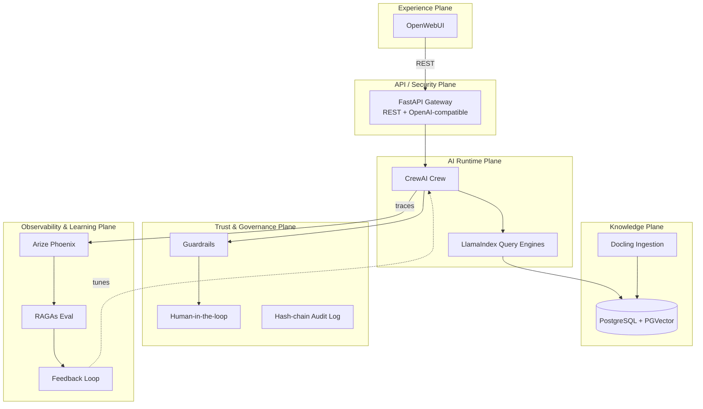
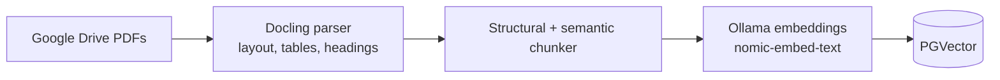
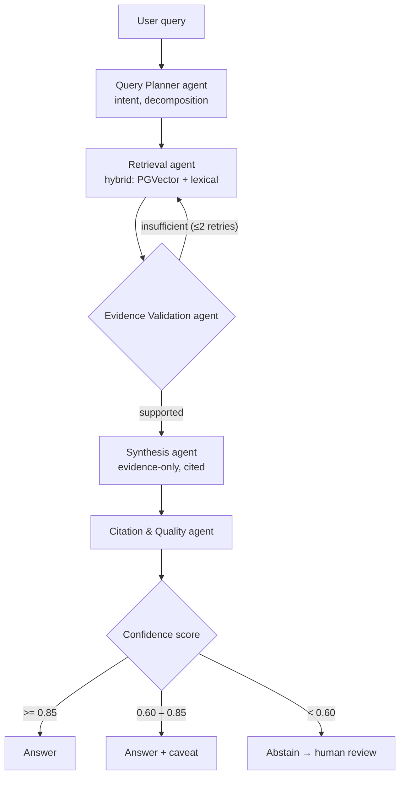
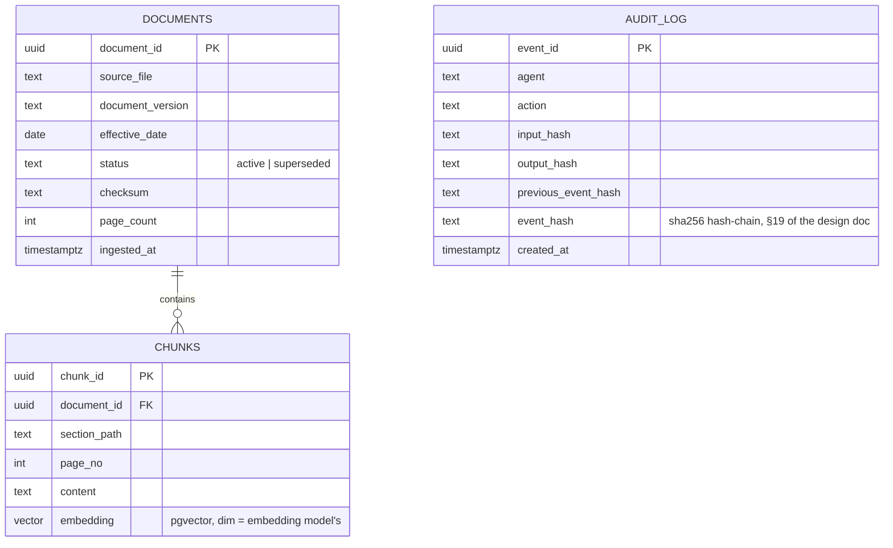

# AegisRAG — Agentic Enterprise Document Intelligence Platform

An observable, evaluable, agentic RAG platform that lets users search and reason over enterprise
documents through OpenWebUI, backed by Docling, PostgreSQL/PGVector, LlamaIndex, CrewAI, Ollama,
Arize Phoenix and RAGAs. Built for a technical assessment, designed the way a production knowledge
platform would be: ingestion → agentic retrieval → grounded, cited answers → traced → evaluated →
governed.

> The full design write-up (fresher vs. senior approach per component, guardrails, human-in-the-loop,
> fallback agents, hash-chain audit logging, the feedback/RAG-error-taxonomy loop, the AI control
> plane, ADRs, and the cloud reference architecture) lives in [`/doc`](./doc) — this README is the
> entry point and the accurate, current status; `/doc` is the deep dive.

## Status — what's actually built vs. designed

This is stated explicitly so nothing here is overclaimed.

| Layer | Status |
|---|---|
| Local tooling (Docker, Ollama, Python venv) | ✅ Installed & verified |
| `docker-compose` services (Postgres+PGVector, Phoenix, OpenWebUI) | ✅ Running locally |
| Repository scaffold + dependencies | ✅ Done |
| Document corpus | ✅ 1 PDF ingested (`EthicsofAI.pdf`, 21 pages → 69 chunks) — see note below |
| Ingestion pipeline (Docling → chunk → embed → PGVector) | ✅ Working — checksum dedupe verified |
| Retrieval (hybrid: PGVector cosine + Postgres full-text, RRF-fused) | ✅ Working |
| CrewAI 5-agent crew (planner → retrieval → evidence validation → synthesis → citation/quality) | ✅ Working end-to-end, bounded retry loop |
| FastAPI OpenAI-compatible endpoint | ✅ Working |
| OpenWebUI wired to the backend | ✅ Verified in-browser — real cited answers rendering |
| Phoenix tracing (every LLM/embedding/retrieval call) | ✅ Verified — spans visible per agent hop |
| Prompts externalized (`/prompts/*.yaml`, versioned) | ✅ Done |
| Guardrails (input/retrieval/output) | ✅ Implemented, unit-tested |
| Hash-chain audit log + `verify` CLI | ✅ Implemented — tamper-detection integration-tested |
| RAGAs golden set + evaluation harness | ✅ Harness built and runs against the real corpus (small golden set — see `/evaluation`) |
| Human-in-the-loop escalation (§17) | ✅ Implemented — risk-based (`guardrails/human_review.py`), `review_queue` table + `/review-queue` API, unit + integration tested |
| Fallback / recovery chain (§18) | ✅ Implemented — agent-level (lexical-only + relaxed-hybrid retrieval strategies) and model-level (primary → fallback model → retrieval-only degrade), in `agents/orchestrator.py` |
| AI control plane (single config surface for all policy) | ✅ Unified — `config/control_plane.py` is the one loader for `agent_policy.yaml`; every threshold, retry bound, risk keyword and fallback toggle lives there, version-stamped onto every audit row |
| Presentation deck | ✅ Done — 14 slides, [`doc/presentation/`](./doc/presentation) (`.pptx`) + a shareable link (ask for it) |
| REST API docs | ✅ Real OpenAPI spec exported to [`doc/api/openapi.json`](./doc/api/openapi.json) — 9 live endpoints |
| ADRs (`doc/architecture/ADR-001..008`) | ✅ Written — one per non-obvious decision, including the two added this pass (HITL/fallback design, control-plane unification) |
| Architecture / security / deployment write-ups in `/doc` | ✅ Written — [`02-solution-architecture.md`](./doc/02-solution-architecture.md), [`09-security-design.md`](./doc/09-security-design.md), [`11-deployment-guide.md`](./doc/11-deployment-guide.md), [`16-production-readiness-gap.md`](./doc/16-production-readiness-gap.md) |
| Cloud reference architecture | ✅ Written as a standalone recommendation — [`12-cloud-reference-architecture.md`](./doc/12-cloud-reference-architecture.md) (GCP). **Still not deployed** — no cloud environment was provisioned for this assessment, and that document says so explicitly rather than implying otherwise |
| API authentication, rate limiting, CI/CD, PII redaction | ⬜ Genuinely not built — no auth/traffic/PII threat model exists at this assessment's single-local-user scale to justify building them now; scoped as concrete recommendations in [`09-security-design.md`](./doc/09-security-design.md) and [`16-production-readiness-gap.md`](./doc/16-production-readiness-gap.md) rather than built speculatively |

**On the corpus**: two PDFs were provided; the second (`EthicalLeadership1.pdf`, 8 pages but image/slide-heavy)
made Docling's layout+OCR model take 30+ minutes per the user's own test and was dropped for this pass
rather than block the rest of the build — noted here rather than silently ignored. It can be re-added
later with OCR disabled (it's born-digital, not scanned, so OCR is unnecessary and is most of the cost).

**Known rough edge**: OpenWebUI issues a second, separate call to generate the chat title for every new
conversation, and that call goes through the same 5-agent pipeline as a real question — so the first
message in a new chat currently costs roughly 2x the pipeline run. Documented here rather than fixed
silently; the fix is to detect OpenWebUI's title-generation system prompt and short-circuit it.

Everything below the fold describes the **target architecture** this repo is being built to. Sections
are marked `[planned]` where the code doesn't exist yet, so this file stays trustworthy as the build
progresses instead of describing code that isn't there.

## Architecture

### Six planes



### Ingestion flow — working, verified against the real corpus



`data/knowledge_base/EthicsofAI.pdf` (21 pages) ingests in ~36s into 69 chunks with page numbers and
section headings attached; re-running is a no-op via checksum dedupe (integration-tested).

### Agentic retrieval — the decision loop — working end-to-end



Five agents, not fifteen — see `/doc/04-agentic-rag-design.md` for why that's the deliberate choice.
Verified live against the real corpus via OpenWebUI, with full Phoenix tracing and audit logging.

## Database design — schema applied, populated, verified



`DOCUMENTS.status` is how version lineage (§3 of the design doc) keeps retrieval from silently mixing
a superseded policy with the current one. `AUDIT_LOG` is the tamper-evident hash chain (§19) — each
row's `event_hash` covers its own content plus the previous row's hash.

## Repository structure

```
aegisrag/
├── README.md                # you are here
├── docker-compose.yml        # Postgres+PGVector, Phoenix, OpenWebUI
├── pyproject.toml            # Python deps
├── Makefile                  # venv / install / up / ingest / api / test / eval
├── .env.example
│
├── src/aegisrag/
│   ├── api/            FastAPI app — /v1/chat/completions, /documents, /ingestion, /feedback,
│   │                    /review-queue (+ /decision), /audit/verify, /health — 9 endpoints
│   ├── config/         settings.py (infra, from .env), agent_policy.yaml + control_plane.py
│   │                    (the single AI-control-plane loader — ADR-008), prompts.py (registry)
│   ├── ingestion/      pipeline.py — Docling parse + HybridChunker + Ollama embed + PGVector upsert
│   ├── retrieval/      hybrid_retriever.py — hybrid (RRF-fused) + lexical-only + relaxed-hybrid
│   │                    strategies (the last two feed agent-level recovery, §18)
│   ├── agents/         definitions.py (5 CrewAI Agents, primary or fallback LLM), orchestrator.py
│   │                    (the decision loop + recovery + model fallback), llm.py, json_utils.py
│   ├── guardrails/     guardrails.py (input/retrieval/output, §16) + human_review.py (risk-based
│   │                    HITL queue, §17) — both unit- and integration-tested
│   ├── audit/           hash-chain writer + `verify` CLI (§19), policy-version-stamped — tested
│   ├── evaluation/     run.py — RAGAs harness against the golden set, baseline-regression check
│   ├── observability/  tracing.py — Phoenix/OTel wiring (LlamaIndex + LiteLLM instrumentation)
│   └── database/       schema.sql (raw DDL, not an ORM) + db.py (psycopg3 connection helper)
│   # chunking/, embeddings/ and feedback/ from the original scaffold were removed — each was an
│   # empty package stub. Chunking/embedding is one library call apiece (Docling's HybridChunker,
│   # llama-index's OllamaEmbedding) folded into ingestion/ and retrieval/; feedback is a DB table
│   # + API endpoint (§20), not a package of its own. Kept out rather than left as dead scaffold.
│
├── prompts/              # externalized prompt templates (§5), versioned YAML — planner/validation/synthesis
├── evaluation/
│   ├── datasets/golden/       # ethics_of_ai.json — 4 real questions against the ingested PDF
│   └── datasets/adversarial/  # prompt-injection / contradiction / stale-version test cases — not yet populated,
│                                tracked in the roadmap below, kept as the one deliberate empty placeholder
├── tests/
│   ├── unit/             guardrails, human-review risk assessment, OpenWebUI task detection, JSON-repair parsing
│   └── integration/      audit hash-chain (tamper detection), review queue, ingestion dedupe — real Postgres
└── doc/
    ├── architecture/ADR-001..008.md   # one per non-obvious decision
    ├── 02-solution-architecture.md · 09-security-design.md · 11-deployment-guide.md
    ├── 12-cloud-reference-architecture.md   # GCP — recommended, not deployed
    ├── 16-production-readiness-gap.md
    ├── api/openapi.json               # exported from the live FastAPI app
    └── presentation/*.pptx            # the 14-slide walkthrough deck
```

`diagrams/`, `infra/` and a `.github/workflows/` CI stub were in the original scaffold but never got
real content — removed rather than left as empty folders implying work that isn't there. Diagrams
live inline as mermaid in this README and in `/doc`; the cloud target is `doc/12-cloud-reference-architecture.md`
(prose, since nothing's been deployed — an empty `infra/terraform/` would have implied otherwise); CI
is tracked honestly in the Status table and roadmap below as not yet built, not stubbed.

## Prerequisites

- Git, Python 3.11 (already on this machine via Homebrew: `/opt/homebrew/bin/python3.11` — the system
  default `python3` is 3.13, which is too new for `crewai`'s published releases, so the venv is
  pinned to 3.11)
- [Docker Desktop](https://www.docker.com/products/docker-desktop) (installed, running)
- [Ollama](https://ollama.com) (installed via Homebrew, running as a background service)

## Setup

```bash
git clone https://github.com/mad0907/aegisRag.git
cd aegisRag

# Python environment
make install          # creates .venv (Python 3.11) and installs all dependencies
                       # also applies scripts/patch_ragas.py — see "Known issues" below

# Infra services
cp .env.example .env
make up                # docker compose up -d : Postgres+PGVector, Phoenix, OpenWebUI
make init-db            # applies src/aegisrag/database/schema.sql

# Local LLM
ollama pull llama3.2:3b          # primary — fast, ~2x qwen2.5:7b-instruct's generation speed on CPU
ollama pull qwen2.5:7b-instruct   # fallback — larger/slower, escalated to only on a primary failure
ollama pull nomic-embed-text

# Put PDFs in data/knowledge_base/, then:
make ingest
make api                # serves on :8080; OpenWebUI (docker-compose) is already pointed at it
```

Open http://localhost:3000, pick the `aegisrag` model (auto-detected), and ask a question about the
ingested documents.

## Running the project

| Command | What it does |
|---|---|
| `make install` | Create `.venv` (Python 3.11) and install all dependencies |
| `make up` / `make down` | Start / stop **all three** docker-compose services at once: Postgres+PGVector, Phoenix, OpenWebUI |
| `make init-db` | Apply the database schema (idempotent) |
| `make ingest` | Run the Docling → PGVector ingestion pipeline over `data/knowledge_base/` |
| `make api` | Run the FastAPI backend on `:8080` — the one thing `make up` does *not* start; run this separately |
| `make webui` / `make phoenix` | Convenience only — opens a browser tab to OpenWebUI (`:3000`) / Phoenix (`:6006`). Neither one *starts* anything; both services are already running once `make up` has run — these just save you typing the URL |
| `make eval` | Run the RAGAs evaluation harness against `evaluation/datasets/golden/` |
| `make verify-audit` | Walk the hash-chain audit log and report PASS/FAIL |
| `make test` | Run the test suite |

## Local service URLs

| Service | URL |
|---|---|
| OpenWebUI | http://localhost:3000 |
| Arize Phoenix | http://localhost:6006 |
| Postgres (PGVector) | `localhost:5433` (db `aegisrag`, user `aegisrag`) |
| Ollama | http://localhost:11434 |
| AegisRAG API | http://localhost:8080 (Swagger UI at `/docs`) |

## Known issues (disclosed, not hidden)

- **`ragas==0.4.3` has a real upstream bug**: it unconditionally imports
  `langchain_community.chat_models.vertexai.ChatVertexAI`, a submodule `langchain-community>=0.4`
  removed. `scripts/patch_ragas.py` patches the installed package to make that import optional (it's
  only used for an `isinstance()` check against a provider we don't use). Runs automatically as part
  of `make install`; safe to re-run.
- **OpenWebUI's title-generation call doubles the cost of the first message in a chat** — see the
  Status table above.
- **The second PDF from the assessment corpus (`EthicalLeadership1.pdf`) isn't ingested** — see the
  Status table for why and the fix.

## Configuration

All runtime config is externalized — see `.env.example`. Nothing is hard-coded: Ollama model names,
Postgres connection, Phoenix collector endpoint, and the agent policy thresholds (`max_iterations`,
`retrieval.min_score`, confidence thresholds for auto-answer / qualify / abstain) all come from
environment/config, not from Python source — see §21 (AI control plane) in the design doc.

## Further reading

- [`/doc`](./doc) — architecture, ADRs, deployment guide, security/threat model, cloud reference
  architecture, production-readiness gap — all written, see the Status table above
- The full design doc (six-plane architecture, agent design, guardrails, human-in-the-loop, fallback
  chains, hash-chain audit logging, the feedback/error-taxonomy loop, cloud reference architecture,
  fresher-vs-senior notes per component) — ask for the link if you don't have it bookmarked.
- **Walkthrough deck** — 14 slides covering the name/positioning, architecture, the live-verified
  ingestion/agent/answer numbers, trust & governance, observability, evaluation, the fresher-vs-senior
  framing, and the honest built-vs-documented status: https://claude.ai/artifact/BziJxaSaFQskjZe3nre3zf
  (private by default — share it from the page's Share menu before sending the link to anyone else),
  or the `.pptx` in [`doc/presentation/`](./doc/presentation).

## Roadmap

Done: ingestion, hybrid retrieval, the 5-agent crew, FastAPI + OpenWebUI wiring, Phoenix tracing,
guardrails, human-in-the-loop, agent- and model-level fallback/recovery, the hash-chain audit log,
a unified AI control plane, a first RAGAs pass, and the full `/doc` write-up (ADRs, architecture,
security, deployment, cloud reference, production-readiness gap) plus the deck. What's left —
genuinely not built, scoped rather than guessed at:

1. Expand the golden + adversarial eval sets (currently 4 questions on 1 document)
2. API authentication + rate limiting (no threat model at single-local-user scale needs them yet —
   see `doc/09-security-design.md`)
3. GitHub Actions CI (lint/test/eval-gate)
4. Fix the OpenWebUI title-generation double-cost issue
5. Re-add the second corpus PDF with Docling OCR disabled (it's born-digital, not scanned)
6. Chaos-test the model-level fallback against an actually-unavailable Ollama instance (the code
   path is implemented and reviewed, not yet exercised against a real outage)
