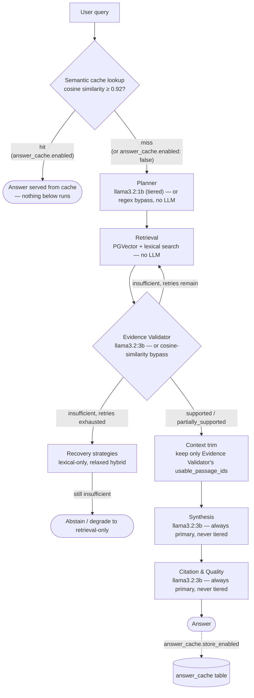

# Latency Optimization

Two genuinely different kinds of latency lever exist in this system, and they answer different
questions. Conflating them overstates what either one proves on its own.

1. **Work avoidance** (`smart_bypass`, `answer_cache`) — *"can I skip work I don't need to do?"*
   Skips an LLM call, or the whole pipeline, when a cheap signal already answers the question.
   Documented in the main README and the presentation deck: **107.8s → 58.3s** measured on this
   corpus with smart bypass on vs. off.
2. **Inference optimization** (`model_tiering`, context trimming) — *"can I make the work itself
   cheaper, without skipping any reasoning step?"* Every agent still runs; the LLM calls
   themselves just cost less. This document covers this second lever specifically, including a
   real negative result — not every "obvious" optimization here held up under measurement.

## Pipeline flow — sequential end to end, no parallel branch

Every arrow below is a real dependency: each step's input is the previous step's output, which is
why nothing in this pipeline runs concurrently (the "Considered, not implemented" section below
covers why that isn't a gap that was missed).



Two things worth noticing in this diagram specifically: the cache lookup and the smart-bypass
checks are the only places latency gets *removed* (arrows that skip straight to an end state);
everything else is one straight chain — Planner through Citation & Quality is a single path with
no fork, so there's no pair of boxes above that could run side by side without changing what each
one depends on.

## Demo toggles (agent_policy.yaml)

All four levers are independently toggleable and take effect on the next `make api` restart
(policy is loaded once at startup and cached — see `config/control_plane.py`):

| Toggle | Controls | Off means |
|---|---|---|
| `smart_bypass.enabled` | Planner regex + Evidence Validator cosine-similarity shortcuts | every question runs the LLM for both steps |
| `answer_cache.enabled` | Cache **lookup** — can a hit short-circuit the pipeline | every question runs the full pipeline, cache never consulted |
| `answer_cache.store_enabled` | Cache **store** — is a fresh answer saved afterward | independent of `enabled` — you can disable lookups for a demo while the cache keeps accumulating data in the background, so flipping lookups back on later has something to hit against |
| `model_tiering.enabled` | Whether Planner runs on `OLLAMA_LIGHT_MODEL` instead of the primary model | Planner runs on the primary model like every other agent |

## Model names, by agent

| Agent | Model when `model_tiering.enabled: true` (default) | Model when `false` |
|---|---|---|
| Planner | `llama3.2:1b` (light tier) | `llama3.2:3b` (primary) |
| Retrieval | — (no LLM call; PGVector + lexical search only) | — |
| Evidence Validator | `llama3.2:3b` (primary) — deliberately never tiered, see below | `llama3.2:3b` |
| Synthesis | `llama3.2:3b` (primary) — deliberately never tiered | `llama3.2:3b` |
| Citation & Quality | `llama3.2:3b` (primary) — deliberately never tiered, see below | `llama3.2:3b` |

Any agent, on a primary/light-model failure, retries once on `qwen2.5:7b-instruct` (the
model-level fallback, §18 — unrelated to tiering, see ADR-004).

## Techniques applied

### 1. Model tiering — Planner only, deliberately

Not every agent needs the same model. `agent_policy.yaml`'s `model_tiering.enabled` routes the
**Planner** to a smaller model (`OLLAMA_LIGHT_MODEL`, `llama3.2:1b`) instead of the primary
(`llama3.2:3b`). Synthesis always stays on the primary model — it's the one step that needs real
generative capability, not classification.

**Evidence Validator and Citation & Quality were also tried on the light model and rejected —
this is the important part.** Both are short structured-JSON calls too, so token budget alone
made them look like equally good candidates. Measured on this corpus with `llama3.2:1b`:

- **Evidence Validator**: started misjudging genuinely-sufficient evidence as `"insufficient"`.
  That triggered extra retrieval retries and the agent-level recovery strategies (§18) — a
  4-iteration run that ended in `degraded_retrieval_only` instead of an answer, and took
  **longer** overall than not tiering at all. Wrong here doesn't fail cheaply: it cascades into
  more retrieval work.
- **Citation & Quality**: returned an unreliable confidence score — `0.00` on a question that
  was, on the primary model, answered at confidence `1.0` with identical evidence. This score is
  exactly what the human-review routing and the auto/qualified-answer thresholds depend on.

**Planner** held up cleanly: its decision (`needs_retrieval`) is coarse, almost always `true` on
this corpus (the same finding that motivated `smart_bypass.planner_heuristic`), and a wrong call
here doesn't corrupt anything downstream — retrieval still runs either way.

The rule this points to: **tier a step by how expensive being wrong is, not by how short its
output is.** A judgment gate the rest of the pipeline trusts (Evidence Validator, Citation &
Quality) is a bad candidate even with a tiny output contract; a coarse, low-stakes classification
(Planner) is a good one. See `orchestrator.py`'s `_LIGHT_TIER_AGENTS` for where this is enforced
in code, and `agents/definitions.py` for the per-agent model wiring.

### 2. Context trimming — use the Evidence Validator's own judgment

The Evidence Validator's prompt contract already asked for `usable_passage_ids` — the subset of
retrieved passages it judged as actually supporting an answer. Until this pass, that field was
computed and then **ignored**: Synthesis and Citation & Quality always received every retrieved
passage regardless of what was actually validated. Now, when the validator ran (not bypassed) and
returned a real, non-empty subset, `nodes` is narrowed to just that subset before building the
evidence text passed to Synthesis. In the measured runs below this regularly cut 4 retrieved
passages down to 1 — a materially shorter prompt into the two most expensive remaining calls, and
citations that only ever point at passages actually judged usable (a correctness improvement, not
just a speed one). No-op on the `smart_bypass` path, which already marks every passage usable.

### 3. Already in place before this pass (confirmed, not re-implemented here)

Per-agent `max_tokens` caps (Planner/Evidence Validator/Citation & Quality capped well below
Synthesis's budget), structured JSON-only output contracts for every non-Synthesis agent, and
`OLLAMA_KEEP_ALIVE` so the model stays resident between requests, were all already done in an
earlier pass — see `agents/definitions.py` and `docker-compose.yml`/deployment docs. Re-verified
still correct; not re-measured here since nothing changed.

## Measured: isolating inference optimization from work avoidance

Same question ("How does the document define existential risk?"), same corpus, `smart_bypass`
and `answer_cache` both **off** in every row below — this isolates the inference-optimization
techniques on their own, on the full un-shortcut 5-agent pipeline. Model warmed with a throwaway
query before each timed run (an untimed first request pays Ollama's model-load cost; a fair
comparison excludes that).

| Config | Wall-clock time | Status | Confidence |
|---|---|---|---|
| Baseline — uniform primary model, no context trim | **30.8s** | answered | 1.0 |
| + model tiering (Planner only) + context trim | **18.7s** | answered | 1.0 |

Both runs retrieved the same 4 chunks and both trimmed to the same 1 validated passage — so the
~12s difference is attributable to Planner and the shorter downstream prompt, not to a different
evidence set. Both produced an identical outcome (`answered`, confidence 1.0), which is the point
of excluding Evidence Validator and Citation & Quality from tiering: the speedup didn't cost
anything in quality, because it wasn't taken from a step where wrong answers propagate.

**Production defaults together** (`smart_bypass` + `answer_cache` + `model_tiering` all on), a
different fresh question, first ask (cache miss): **21.1s**, `answered_with_caveat`, confidence
0.8 — Planner and Evidence Validator both bypassed by their cheap heuristics, only Synthesis and
Citation & Quality actually called the LLM. This is the realistic number for a first-time
question in the shipped configuration; it's not directly comparable to the isolated 30.8s/18.7s
pair above since bypass changes *which* steps run, not just how fast they run.

## Considered, not implemented — with honest reasons

Raised as further options; each has a real reason it isn't in this build rather than just being
skipped:

- **Parallelizing independent agent calls.** The actual pipeline (Planner → Retrieval → Evidence
  Validator → Synthesis → Citation & Quality) is a genuine sequential dependency chain — each
  step's input is the previous step's output, as the diagram above shows: one path, no fork. The
  only way to get a parallel branch would be to invent a 6th agent whose input is Retrieval's
  output but whose result isn't needed by Evidence Validator — something like this:

  ```mermaid
  flowchart TD
      RET["Retrieval"] --> EV["Evidence Validator<br/>llama3.2:3b"]
      RET -.->|"hypothetical — not built,<br/>no such agent exists in this design"| QQ["Query Quality / Risk Check<br/>would need a genuinely new 6th agent"]
      EV --> JOIN{{"join: wait for both"}}
      QQ -.-> JOIN
      JOIN --> SYN["Synthesis"]
  ```

  Not built, because it would mean adding a step for the sake of having something to parallelize,
  not because the pipeline needs a 6th agent — the opposite of the "five agents, not fifteen"
  design choice this build already made (§4 of the design doc).
- **Streaming (TTFT).** Would improve perceived responsiveness, not end-to-end latency — a UX
  change, not an inference-speed one. Not implemented because CrewAI's `Task.execute_sync()` does
  not expose a token-level streaming interface; wiring true streaming through would mean bypassing
  CrewAI's task execution for the raw Ollama call, undermining the reason CrewAI is used at all.
  Worth revisiting if CrewAI adds native streaming support.
- **Quantization.** Ollama's published models are already served pre-quantized (GGUF); no
  additional quantization pass was applied or benchmarked separately in this pass. Not claiming a
  number here without measuring it, per the same standard as everything else in this document.
- **GPU/Metal acceleration.** This is documented elsewhere (ADR-004, the deployment guide) as
  CPU-only hardware for this assessment — not re-verified here since it wasn't a new question this
  pass raised.
